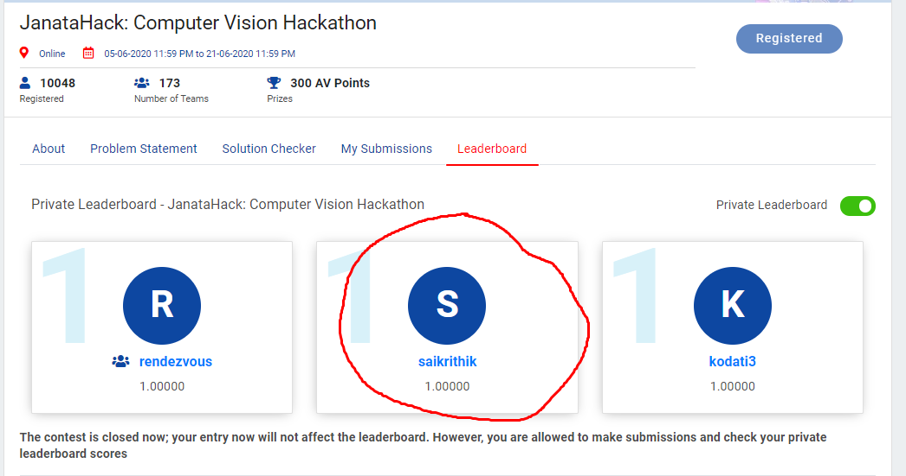
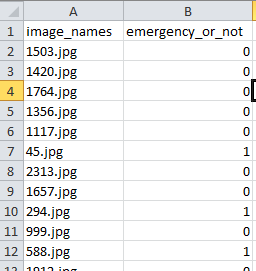
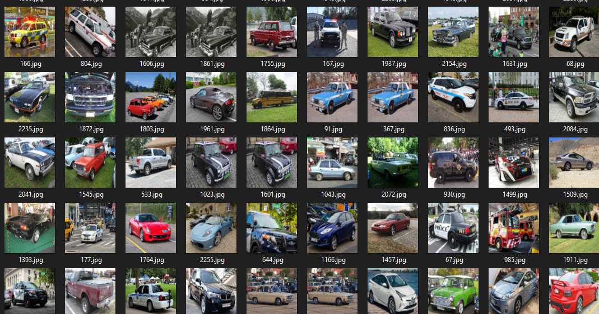
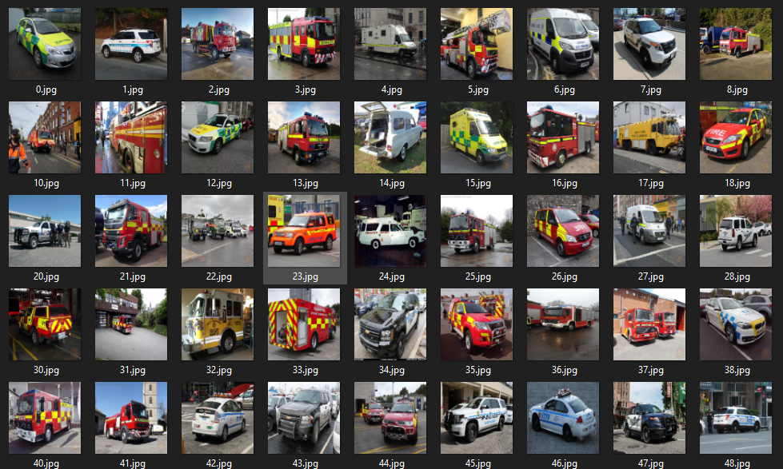

# JanataHack-Computer-Vision-Hackathon
Winning solution for JanataHack: Computer Vision Hackathon
## Private LB Rank:1
### Leader Board:

#### Emergency vs Non-Emergency Vehicle Classification
Fatalities due to traffic delays of emergency vehicles such as ambulance & fire brigade is a huge problem. In daily life, we often see that emergency vehicles face difficulty in passing through traffic. So differentiating a vehicle into an emergency and non emergency category can be an important component in traffic monitoring as well as self drive car systems as reaching on time to their destination is critical for these services.
  
In this problem, you will be working on classifying vehicle images as either belonging to the emergency vehicle or non-emergency vehicle category. For the same, you are provided with the train and the test dataset. Emergency vehicles usually includes police cars, ambulance and fire brigades.
### Data Description:-
- train.zip: contains 2 csvs and 1 folder containing image data
  1. train.csv – [‘image_names’, ‘emergency_or_not’] contains the image name and correct class for 1646 (70%) train images
  2. images – contains 2352 images for both train and test sets
- test.csv: [‘image_names’] contains just the image names for the 706 (30%) test images- 
- sample_submission.csv: [‘image_names’,’emergency_or_not­’] contains the exact format for a valid submission (1 - For Emergency Vehicle, 0 - For Non Emergency Vehicle)
## Data at a Glance

## Data Photos

#### Data Augmentation & Approach
1. Regular Transformation and data augmentation.
2. Used Fastai Resnet101 model.
#### Tools used
1. Python for programming
2. numpy library for methodology
3. OpenCV for reading the images and stuff.
3. fastai library for the model
4. matplotlib and seaborn was used for plotting and analyzing the data
##### Data_Leak(Sorted images shows everything!)

#### Competition Result
Rank: 5th on public LB and **1st** on private LB\
[Link to LeaderBoard](https://datahack.analyticsvidhya.com/contest/janatahack-computer-vision-hackathon/#LeaderBoard)
